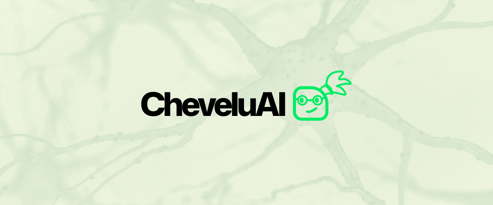

# CheveluAI



A self-hosted, Codex-style AI workspace. Chat with your own model, organize work
into **Projects** (each with its own pre-prompt), and manage **MCP** servers that
you can attach to projects to give the model tools.

CheveluAI ships **not connected to any model**. You point it at *your own*
OpenAI-compatible endpoint — typically an external [LiteLLM](https://docs.litellm.ai/)
gateway — from **Settings**. Nothing about the model is hardcoded.

## Features

- **Chat** — streaming conversations, agentic tool-calling, conversation history,
  and a **model picker in the composer** to switch model per message.
- **Projects** — group conversations, give each a custom system pre-prompt, an
  optional model override, and attach one or more MCPs.
- **MCP management (CRUD)** — create MCPs three ways and attach them to any
  number of projects:
  1. **Remote** — connect to an existing MCP server over streamable HTTP (JSON-RPC).
  2. **Code** — paste your own Python that defines tools.
  3. **OpenAPI** — drop in an `openapi.json` (e.g. from a FastAPI app) or its URL
     and an MCP tool set is **generated on the fly** from the spec.
- **Settings** — a dedicated settings workspace with its own sidebar, split into
  three sections:
  - **General** — appearance (light / dark / system) and **interface language
    with full English / French i18n**.
  - **Models** — configure the gateway connection (base URL, API key, max tool
    iterations), **discover** models from the gateway's `/v1/models`, **activate**
    the ones you want, pick a **default model**, and optionally give any model its
    own **per-model connection override** (its own base URL + API key) to hit a
    provider directly without a gateway.
  - **Storage** — **export** your whole app to a single JSON file and **import**
    it back, with per-category filtering (settings & models, projects, MCPs,
    chats & messages).

## Architecture

```
frontend/   React + Vite + TypeScript + Tailwind v4 (Mona Sans, custom palette)
            TanStack Router (URL routing) + TanStack Query (server state)
            shadcn/ui primitives, incl. the AI components (Message, Bubble,
            Marker, Attachment) and the @shadcn/react Message Scroller for the
            chat transcript
backend/    FastAPI + SQLModel (SQLite) — LLM proxy, MCP runtime, OpenAPI→tools
```

## Running locally

### Backend

```bash
cd backend
python -m venv .venv && source .venv/bin/activate
pip install -r requirements.txt
uvicorn app.main:app --reload --port 8000
```

### Frontend

```bash
cd frontend
npm install
npm run dev        # http://localhost:5173 (proxies /api to :8000)
```

Then open the app, go to **Settings → Models**, enter your LiteLLM base URL +
API key, **Discover** and activate a model (set one as default), and start
chatting.

## Deployment (Docker / Dokploy)

CheveluAI ships as a **single container**: the multi-stage [`Dockerfile`](./Dockerfile)
builds the frontend, then the FastAPI backend serves both the API (`/api/*`) and
the built static app (with an SPA fallback so client-side routes work on refresh).
SQLite is stored on a volume so data survives redeploys.

```bash
# build & run locally
docker compose up --build        # → http://localhost:8000
```

### On Dokploy

1. Create a new application from this repository.
2. Build type: **Docker Compose** (uses [`docker-compose.yml`](./docker-compose.yml))
   or **Dockerfile** (uses [`Dockerfile`](./Dockerfile)) — either works.
3. Attach a **persistent volume** mounted at `/data` (the SQLite DB lives at
   `/data/cheveluai.db`, set via `CHEVELUAI_DB`).
4. Set the application **port to `8000`** and point your domain at it; Dokploy's
   Traefik handles TLS.
5. Deploy, then open **Settings → Models** and connect your model as above.

| Env var            | Default                 | Purpose                                  |
| ------------------ | ----------------------- | ---------------------------------------- |
| `CHEVELUAI_DB`     | `/data/cheveluai.db`    | SQLite database path (put it on a volume)|
| `CHEVELUAI_STATIC` | `/app/static`           | Directory of the built frontend to serve |

The LLM connection (base URL, key, model) is configured at runtime from
**Settings** — nothing model-related needs to be baked into the image.

## Design

See [`DESIGN.md`](./DESIGN.md). CheveluAI adapts that system with its own palette:
primary `#00ED64`, background `#FFFFEB`, secondary `#001E2B`, and the open-source
variable **Mona Sans** typeface (ExtraBold for display, Medium for body).
